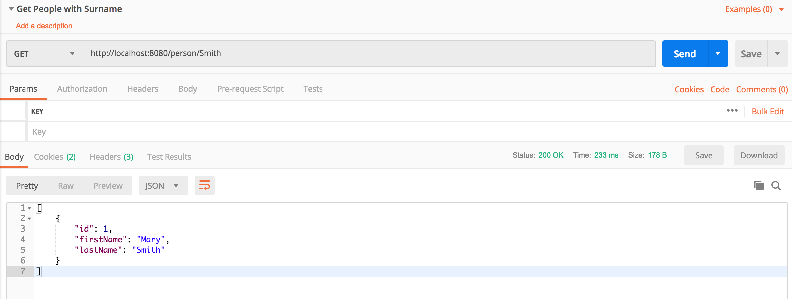
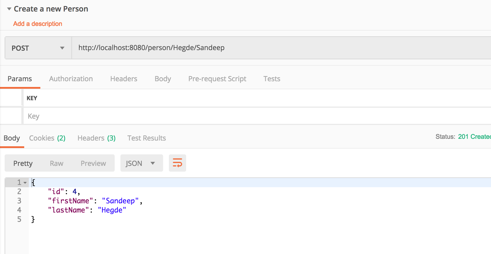

# Hunter Six - Java Spring RESTful API Test

## How to build
```./gradlew clean build```

## How to test
```./gradlew test```

## Exercises
### Exercise 1
Make the tests run green (there should be one failing test)

#### Solution
add `static` keyword to `counter` variable in `Person` model class 

### Exercise 2
Update the existing `/person/{lastName}/{firstName}` endpoint to return an appropriate RESTful response when the requested person does not exist in the list
- prove your results

#### Solution

    @GetMapping("/person/{lastName}/{firstName}")
    public ResponseEntity<Person> person(@PathVariable(value="lastName") String lastName,
                                         @PathVariable(value="firstName") String firstName) {
        Person person = personDataService.findPerson(lastName, firstName);

        if (person == null) {
            // Below line should be replaced by logger statements.
            System.out.println("Person not found");
            return new ResponseEntity<>(HttpStatus.NOT_FOUND);
        }

        return new ResponseEntity<>(person, HttpStatus.OK);
    }

### Exercise 3
Write a RESTful API endpoint to retrieve a list of all people with a particular surname
- pay attention to what should be returned when there are no match, one match, multiple matches
- prove your results

#### Solution

`Controller changes`
    
    @GetMapping("/person/{lastName}")
    public ResponseEntity<List<Person>> personWithSurname(@PathVariable(value="lastName") String lastName) {
        List<Person> people = personDataService.findPersonWithSurname(lastName);
        if (people == null) {
            // Below line should be replaced by logger statements.
            System.out.println("no Person found with this surname");
            return new ResponseEntity<>(HttpStatus.NOT_FOUND);
        }

        return new ResponseEntity<>(people, HttpStatus.OK);
    }
    
`Service changes`

    public List<Person> findPersonWithSurname(String lastName) {
        // Return an array of Person objects. It doesn't matter if there is one match or multiple matches.
        return PERSON_DATA.stream()
                .filter(p -> p.getLastName().equalsIgnoreCase(lastName))
                .collect(Collectors.toList());
    }
    


### Exercise 4
Write a RESTful API endpoint to add a new value to the list
- pay attention to what should be returned when the record already exists
- prove your resutls

#### Solution

`Controller changes`

    @PostMapping("/person/{lastName}/{firstName}")
    public ResponseEntity<Person> addPerson(@PathVariable(value="lastName") String lastName,
                            @PathVariable(value="firstName") String firstName) {
        Person person = personDataService.addPerson(lastName, firstName);
        return new ResponseEntity<>(person, HttpStatus.CREATED);
    }
    

`Service changes`

    public Person addPerson(String lastName, String firstName) {

        boolean isPersonPresent = PERSON_DATA.stream()
                .anyMatch(p -> p.getFirstName().equalsIgnoreCase(firstName)
                        && p.getLastName().equalsIgnoreCase(lastName));

        if (isPersonPresent) {
            // The below statement should be replaced with log statements.
            System.out.println("No operation needed");
            return null;
        }

        Person newPerson = new Person(firstName, lastName);
        PERSON_DATA.add(newPerson);
        return newPerson;
    }


